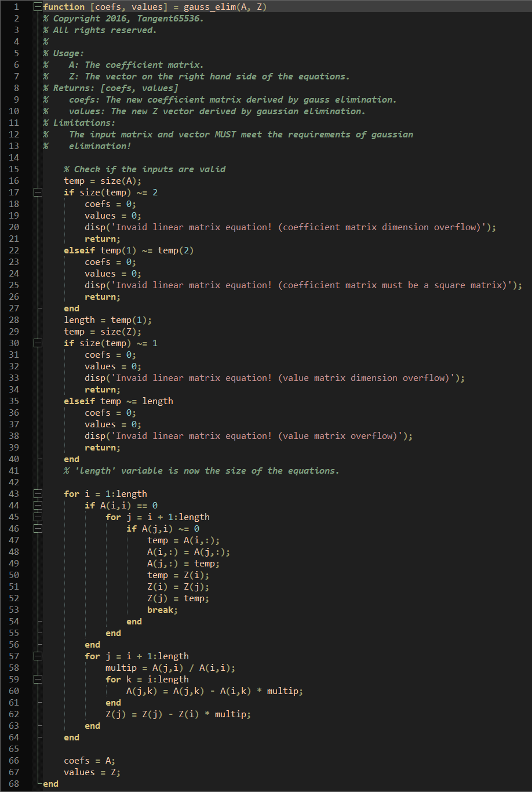
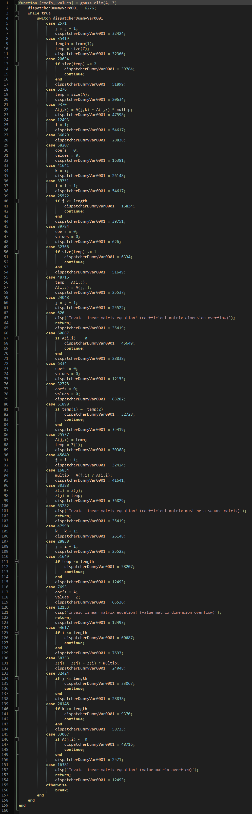

# Matlab Code Obfuscator
Copyright (c) 2022, *Tangent65536*. **All rights reserved.**  

---

*MATLAB(R) is the property of The MathWorks, Inc.*  
*We are not affiliated, associated, authorized, endorsed by,*  
*or in any way officially connected with The MathWorks, Inc.*  

---

## Intro
The main goal of this tool is to provide a more robust way to obfuscate Matlab codes. As it turns out, the official tools provided in the Matlab Compiler SDK, `pcode` and `mcc`, do not actually compile or even obfuscate the input codes. Alternatively, `mcc` only encrypts the code using a 256-bit AES key, while `pcode` is just a tool to encode input code into a specific format before applying a trivial cyclic XOR operation. None of them remove key information such as variable names to further protect the packaged codes. Unfortunately, both `mcc` and `pcode` has been successfully reverse-engineered and one can find open-source tools online to do the job. Hence, relying on merely the official SDK is not a secure way to protect one's codes.  

Luckily, multiple techniques have been developed by researchers and programmers to transform original source code into hardly readable forms. One of them is *control flow flattening*. The key concept is to turn input code into a mess by abusing branching/jumping statements, such as `goto` or `switch`/`case` to reproduce the behavior flow. Such transformation removes all the nested conditional and loop blocks ("flattening") as they can be achieved by only using the branching/jumping statements.  

---

## Functionality and Limitations
This program performs **control flow flattening** against the input `.m` script file. That's **all** it does. Currently, no renaming and string/constant obfuscation is implemented. I do plan to have constants obfuscation supported in the future.  

Also, the `switch/case` keywords are not supported, and `try/catch` will not obfuscate the `try` block. The program is not yet optimized either and the code is a bit messy. The largest script I have run my program against is only around 50 KiB in size, so use it at your own risk.  

Below is an example of the transformation made by this tool.  

---

Original code:  

  

  
---

Obfuscated code:

  

